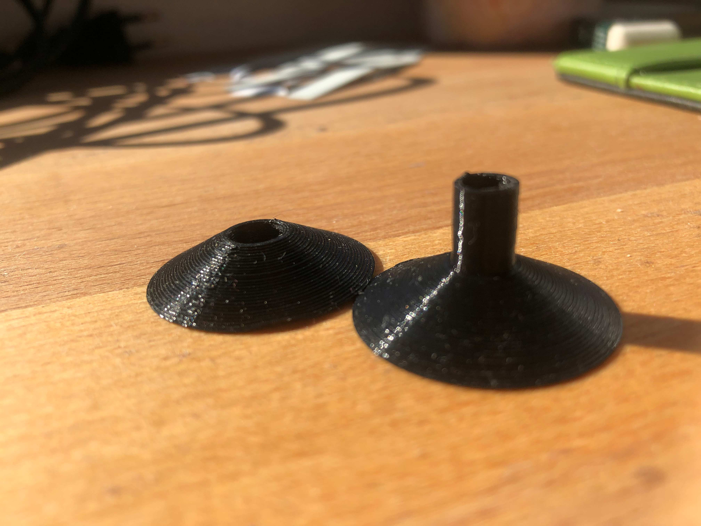
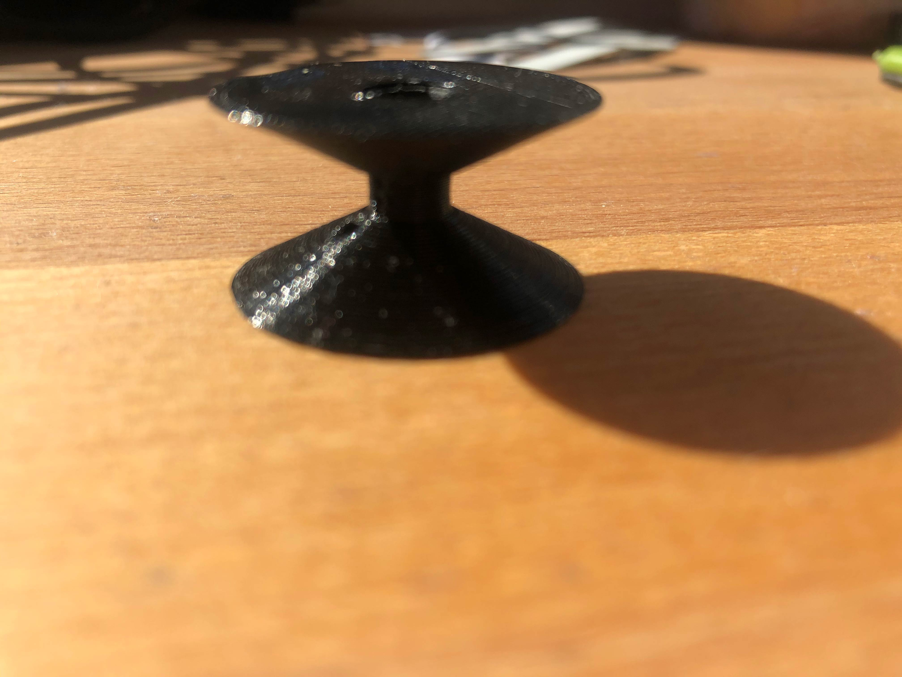
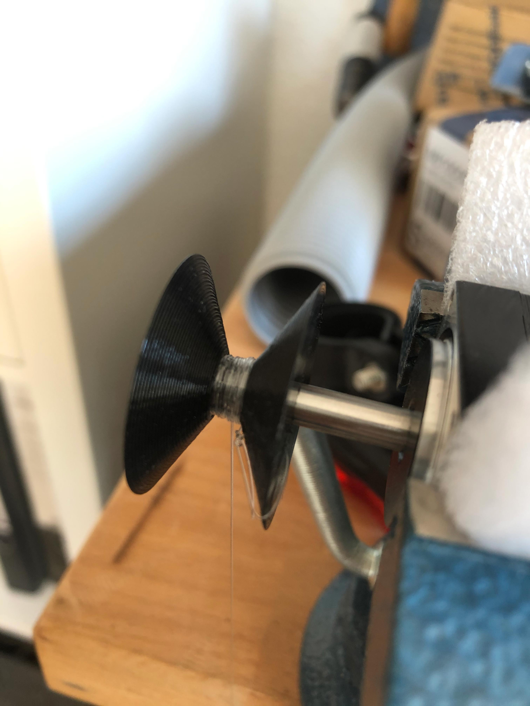
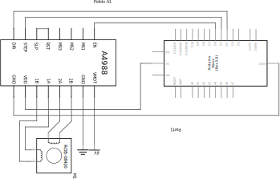
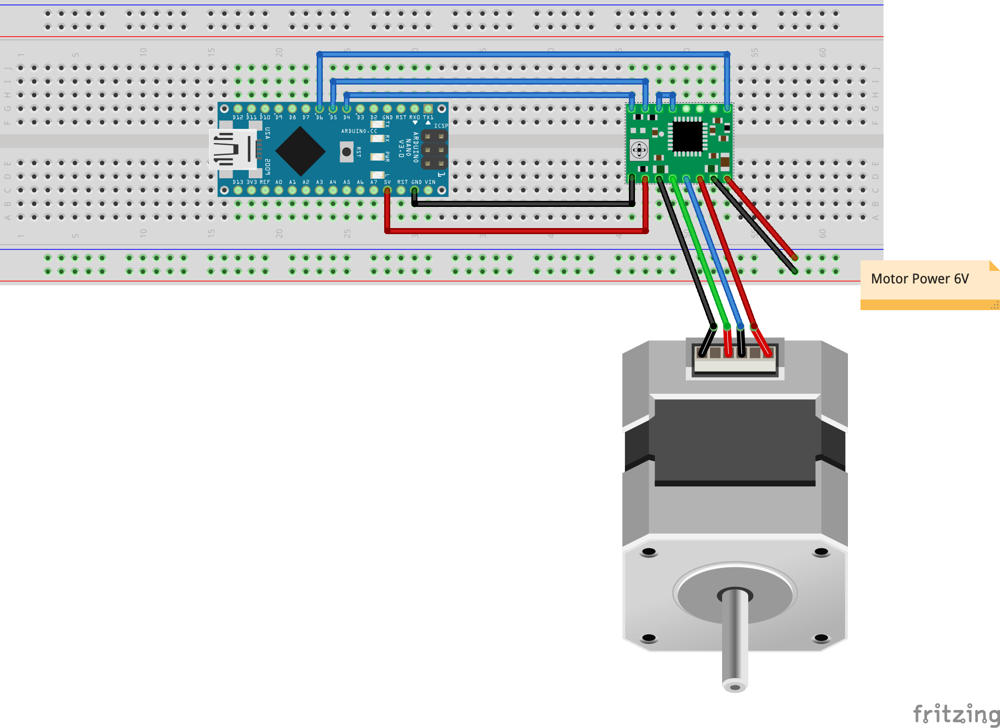
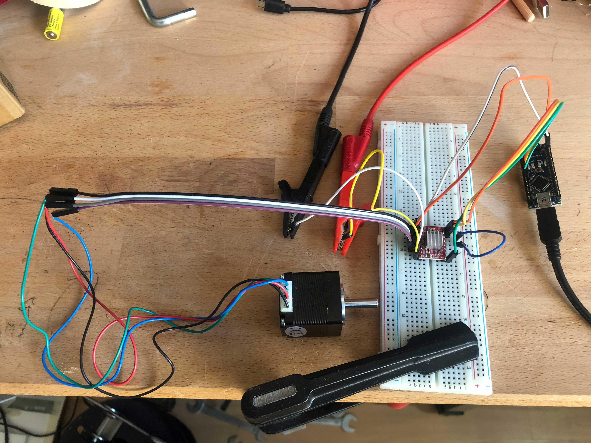
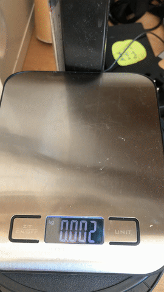

# Nema Stepper Motor with Arduino and A4988 Driver

For one of my next projects I wanted to use the 28BYJ-48 Stepper motor, but while trying out, I came to realize that this motor does not have enough torque for the project.

This was the time when I figured there are a bunch of other stepper motors, called the NEMA Motors. They come in different sizes and shapes and I just bought a NEMA 8 and a NEMA 11 motor to compare them.

**To drive a NEMA stepper, you need:**

- [NEMA 8](https://amzn.to/3rWgJpy) and or [NEMA 11](https://amzn.to/3csokFZ) Stepper Motor
- [Arduino Nano with USB Cable](https://amzn.to/2OkORxa)
- [A4988 driver board](https://amzn.to/38B3nYn)
- [Breakout board](https://amzn.to/3ldfuzP)
- [Jumper cables](https://amzn.to/3ckzJre)
- [Nylon Rope](https://amzn.to/38C5Gu9)
- [Laboratory Power Supply](https://amzn.to/3tgF5dY) or [6V Battery Case](https://amzn.to/30DG1ga)
- A 3D Printer (If you want to print a winch)

## Winch (3D Printed)

To test the torque I needed a Winch and I decided to use [Tinkercad](https://www.tinkercad.com/) to draw some. Tinkercad is quite easy to use and I recommend it for beginners. It has everything needed to make lots of projects and it's free.

For the NEMA 11 I had some issues with the overhang so I created a special version which can be printed in two pieces and then glued together.

You can download the winch from Thingiverse: [Winch for Nema 11](https://www.thingiverse.com/thing:4792611/files)





## Schematic View



## Bread Board

This is how to set things up on a bread board.



## The Arduino Code

This is a pretty simple version of the code which run the motors in both directions. Just copy this to your Arduino IDE, select the correct Arduino board and upload it. Be careful, the motors will start right after upload.

```c
int stepCounter;
int steps = 2000;

void setup()
{
   pinMode(6, OUTPUT); // enable
   pinMode(5, OUTPUT); // step
   pinMode(4, OUTPUT); // direction
   digitalWrite(6,LOW);
}

void loop()
{
   digitalWrite(4,HIGH); // counterwise
   for(stepCounter = 0; stepCounter < steps; stepCounter++)
   {
      digitalWrite(5,HIGH);
      delayMicroseconds(500);
      digitalWrite(5,LOW);
      delayMicroseconds(500);
   }

   delay(1000);

   digitalWrite(4,LOW); // counterclockwise
   
   for(stepCounter = 0; stepCounter < steps; stepCounter++)
   {
      digitalWrite(5,HIGH);
      delayMicroseconds(500);
      digitalWrite(5,LOW);
      delayMicroseconds(500);
   }

   delay(1000);
}
```

## Assembly

First mount the winch on to the motor. You may need some filing and pushing to get it onto the shaft.

Then get your breadboard and some cables and put everything together like in the breadboard picture above.

Then connect your Arduino with your computer and upload the code.

Once uploaded, connect the main power source to the motor and it should immediately start spinning. If not head over to the FAQ below.

This is how it looks like in my setup



## Results

Here you can see a little video of my test setup. It does not look professional but it does the job for me.



With this setup I figured that the NEMA 8 was able to pull around 200 gramms, wheras the NEMA was ablet to hold up to 700 grams.

## FAQ

### The stepper motor is just making sounds, but is not moving

In my experiments this happenes when the motor does not have enough power (voltage). I first tried to use a converter which creates 5V out off the USB port, but this was not enough current to power the motor. So please use an external power supply or battery pack to drive the motor.

### What is 28BYJ-48?

This is a very cheap stepper motor (see [here](https://amzn.to/3bENSk1)). Beacause of its low price it is used a lot in IoT projects. The downside of the motor is, that it does not have a lot of torque

28BYJ-48 35 mm x 30 mm, 0,034 Nm -> That means around 200 gramms

### What is NEMA?

NEMA (National Electrical Manufacturers Association) is a group that has standardized the motors (and their torque). They still come in different length so, so watch out:

- NEMA 08, 20 mm × 20 mm, 0,036 Nm
- NEMA 11, 28 mm × 28 mm, 0,1 Nm
- NEMA 14, 35 mm × 35 mm, 0,3 Nm
- NEMA 17, 42 mm × 42 mm, 0,5 Nm
- NEMA 23, 56 mm × 56 mm, 2,0 – 4,0 Nm
- NEMA 34, 86 mm × 86 mm, 4,5 – 8,0 Nm

## Please support me

If you want to help me writing more blog posts please use the affiliate links above to buy stuff. You can also donate a litte amount using the link below or (or scan the QR Code). 

Thanks a million times!

<form action="https://www.paypal.com/donate" method="post" target="_top">
<input type="hidden" name="hosted_button_id" value="RT2TB3FZGGFMQ" />
<input type="image" src="https://www.paypalobjects.com/en_US/DK/i/btn/btn_donateCC_LG.gif" border="0" name="submit" title="PayPal - The safer, easier way to pay online!" alt="Donate with PayPal button" />

</form>

QR Code:

